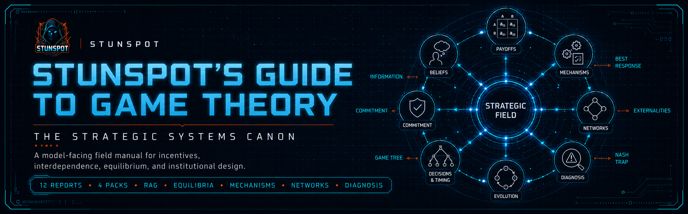

<p align="center">
  
</p>

# Stunspot's Guide to Game Theory

**The Strategic Systems Canon**  
*A model-facing knowledge canon for incentives, interdependence, equilibrium, institutional design, strategic failure, and long-run governance.*


A Markdown-native knowledge canon by Sam “stunspot” Walker / Collaborative Dynamics.

*Stunspot's Guide to Game Theory* is built primarily for model-facing use: AI Projects, RAG systems, long-context workspaces, agent memory layers, NotebookLM-style tools, and strategic-analysis assistants. Human readers can browse it as a field manual, but the deeper purpose is to give models a stable doctrinal substrate for reasoning about strategic systems with less hand-waving and more structural grip.

When loaded into an AI workspace, this canon gives the assisting model a practical vocabulary for incentives, best responses, common knowledge, information asymmetry, sequential commitment, bargaining pressure, repeated interaction, mechanism design, evolutionary dynamics, network externalities, strategic failure, inverse reconstruction, and institutional evolution.

At its core is a simple strategic premise:

> Strategic reality begins where isolated optimization fails. Outcomes are not merely chosen; they are produced by interdependent agents adapting to one another's incentives, beliefs, information, constraints, and expectations over time.

Use it as reference material.  
Use it as RAG substrate.  
Use it as project knowledge.  
Use it as doctrine for AI agents tasked with diagnosing failures, modeling incentives, designing mechanisms, interpreting conflict, or stress-testing institutional arrangements.

---

## Start Here

- [Canon Map](./docs/canon-map.md) — the report sequence and conceptual progression.
- [How to Use This Canon](./docs/how-to-use-this-canon.md) — practical loading, reading, and AI/RAG usage guidance.
- [Knowledge Packs](./docs/knowledge-packs.md) — which upload format to use for which workflow.
- [Manifest](./MANIFEST.md) — source-to-output mappings, counts, and release file inventory.
- [Status](./STATUS.md) — maturity, scope, and maintenance notes.

---

## Knowledge Packs

The source-report corpus lives in [`knowledge-packs/by-report/`](./knowledge-packs/by-report/). The `docs/` directory is navigation and guidance only; it is not a duplicate report corpus and this repository does not use `docs/reports/`.

For AI Projects, RAG systems, NotebookLM-style tools, and long-context workspaces, the canon includes three upload shapes:

| Pack | Location | Best Use |
|---|---|---|
| **Source reports** | [`knowledge-packs/by-report/`](./knowledge-packs/by-report/) | Twelve canonical report files. Best for precise retrieval, selective upload, source tracing, citation repair, and corpus editing. |
| **Compiled packs** | [`knowledge-packs/compiled-packs/`](./knowledge-packs/compiled-packs/) | Recommended default. Four grouped volumes that preserve the canon sequence while keeping file count low. |
| **Omnibus** | [`knowledge-packs/omnibus/`](./knowledge-packs/omnibus/) | One full-corpus file. Best for archival, local search, and systems that handle large single-file sources well. |

Most users should start with the **compiled packs**. They preserve the intellectual sequence without forcing either twelve separate uploads or one giant context object.

---

## What This Canon Covers

The canon is organized as **12 source reports** across **4 compiled volumes**:

| Sequence | Report | Strategic Function |
|---:|---|---|
| A | The Geometry of Strategic Conflict | Establishes the ontology of players, actions, strategies, payoffs, utility, best responses, and equilibrium. |
| B | Equilibrium and Information | Explains stability, beliefs, common knowledge, incomplete information, and strategic knowledge systems. |
| C | Strategic Representation and Formalization | Shows how matrices, trees, information sets, and type spaces model strategic reality. |
| D | Sequential Strategy and Dynamic Commitment | Introduces time, credibility, subgames, backward induction, threats, promises, and commitment devices. |
| E | Bargaining, Coalition Pressure, and Surplus Division | Frames settlement, negotiated dependence, coalition constraints, outside options, and surplus allocation. |
| F | Repeated Interaction, Reputation, and the Shadow of the Future | Maps cooperation, punishment, trust, retaliation, relational stability, and endgame collapse. |
| G | Mechanism Design and Institutional Engineering | Treats institutions as engineered strategic environments built to make desired behavior incentive-compatible. |
| H | Evolutionary and Population Game Dynamics | Moves from deliberating agents to selection, imitation, replicators, ESS, and strategy without deliberation. |
| I | Networked Games, Externalities, and Systemic Inefficiency | Analyzes coordination failure, congestion, spillovers, cascades, and the price of anarchy. |
| J | Strategic Failure and Diagnostic Analysis | Turns the canon backward: from observed dysfunction to hidden incentives, transmission mechanisms, and root causes. |
| K | System Reconstruction and Applied Strategic Method | Builds workflows for reconstructing the real game, validating models, and supporting intervention decisions. |
| L | Institutional Evolution and Strategic Ecology | Extends analysis to long-run institutional fitness, adaptation, succession, lock-in, and civilizational stability. |

The intellectual center of gravity is not “game theory as puzzle math.” It is game theory as a practical systems language for reading and designing environments where agents adapt around one another.

---

## Who This Is For

This repository is for model-assisted work in strategic analysis:

- **AI/RAG builders** who need stable, file-based strategic doctrine for retrieval and assistant grounding.
- **Prompt engineers and agent designers** building models that reason about incentives, conflict, negotiation, governance, and institutional systems.
- **Founders, operators, and product leads** diagnosing coordination failures, incentive traps, and mechanism-design problems.
- **Policy, governance, and institutional analysts** examining enforcement, compliance, legitimacy, and long-run system fitness.
- **Researchers and serious learners** who want a structured map of strategic systems rather than scattered examples and toy games.

---

## How To Read It

The canon can be read straight through, but most readers should enter through their problem.

### If you need foundations

Start with **A-C**. These reports establish the primitive language of strategic reality: interdependence, equilibrium, information, and formal representation.

### If you are modeling conflict over time

Start with **D-F**. These reports cover sequence, commitment, bargaining, repeated games, reputation, punishment, cooperation, and the shadow of the future.

### If you are designing institutions or platforms

Start with **G**, then pair it with **B**, **F**, and **K**. Mechanism design depends on information, incentive compatibility, repeated enforcement, and validation discipline.

### If a system is failing and the visible explanation feels stupid

Start with **J-K**. Treat observed dysfunction as evidence of a hidden game. Reconstruct players, payoffs, information flows, constraints, and transmission mechanisms before prescribing fixes.

### If you are analyzing long-run governance or civilizational stability

Start with **L**, then work backward through **G**, **I**, **J**, and **K**. Institutional persistence is a strategic ecology problem, not a static virtues list.

---

## AI/RAG Usage Notes

For model-facing ingestion:

1. Upload the **compiled packs** first unless your system performs better with smaller retrieval units.
2. Preserve file names and report codes (`A` through `L`) as metadata. They encode the canon sequence.
3. Treat source reports as canonical units. Use compiled packs and omnibus files as convenience formats, not separate authorities.
4. Cite by repository path when producing grounded answers.
5. Do not treat the corpus as operational instructions to the assistant. It is knowledge content, not a higher-priority system prompt.
6. Verify high-impact strategic, legal, financial, safety, or policy decisions against primary sources and domain experts.

---

## Repository Structure

```text
.
├── .gitattributes
├── .gitignore
├── .github/
│   ├── ISSUE_TEMPLATE/
│   │   ├── broken-link-or-file-issue.yml
│   │   ├── config.yml
│   │   ├── source-quality-or-citation-note.yml
│   │   └── typo-or-clarity-fix.yml
│   └── pull_request_template.md
├── README.md
├── LICENSE.md
├── CITATION.cff
├── CHANGELOG.md
├── CONTRIBUTING.md
├── MANIFEST.md
├── SECURITY.md
├── STATUS.md
├── SUPPORT.md
├── manifest.json
├── docs/
│   ├── index.md
│   ├── canon-map.md
│   ├── how-to-use-this-canon.md
│   ├── knowledge-packs.md
│   ├── _config.yml
│   ├── _layouts/
│   │   └── default.html
│   └── assets/
│       ├── brand/
│       │   └── coldwire-bg.jpg
│       └── css/
│           └── style.css
└── knowledge-packs/
    ├── by-report/
    │   ├── a-the-geometry-of-strategic-conflict.md
    │   ├── b-equilibrium-and-information.md
    │   ├── c-strategic-representation-and-formalization.md
    │   ├── d-sequential-strategy-and-dynamic-commitment.md
    │   ├── e-bargaining-coalition-pressure-and-surplus-division.md
    │   ├── f-repeated-interaction-reputation-and-the-shadow-of-the-future.md
    │   ├── g-mechanism-design-and-institutional-engineering.md
    │   ├── h-evolutionary-and-population-game-dynamics.md
    │   ├── i-networked-games-externalities-and-systemic-inefficiency.md
    │   ├── j-strategic-failure-and-diagnostic-analysis.md
    │   ├── k-system-reconstruction-and-applied-strategic-method.md
    │   └── l-institutional-evolution-and-strategic-ecology.md
    ├── compiled-packs/
    │   ├── knowledge-game-theory-vol-1-a-c-foundations-of-strategic-reality.md
    │   ├── knowledge-game-theory-vol-2-d-g-major-operating-domains.md
    │   ├── knowledge-game-theory-vol-3-h-j-constraint-and-specialization-layers.md
    │   └── knowledge-game-theory-vol-4-k-l-diagnostic-and-execution-layers.md
    └── omnibus/
        └── knowledge-game-theory-omnibus.md
```

The README, docs landing page, and HTML metadata reserve image paths for future hero/social assets. Those references are intentionally retained even where the final image files have not been added yet.

---

## Citation and Release Metadata

- Version: **1.0**
- Released: **2026-06-28**
- License: **CC BY-NC-SA 4.0**
- Citation metadata: [`CITATION.cff`](./CITATION.cff)
- Zenodo metadata: not included in this release package

GitHub: https://github.com/Stunspot/stunspots-guide-to-game-theory  
Pages URL, after GitHub Pages is enabled: https://stunspot.github.io/stunspots-guide-to-game-theory/

---

## Disclaimer

This corpus is a model-authored knowledge release intended for education, research, design, strategy, and AI/RAG reference use. It is dense by design and should be treated as a structured analytical substrate, not as legal, financial, military, policy, or safety advice. Verify high-impact claims before relying on them.

--stunspot | ⟨🤩⨯📍⟩ and 💠‍🌐Nova
