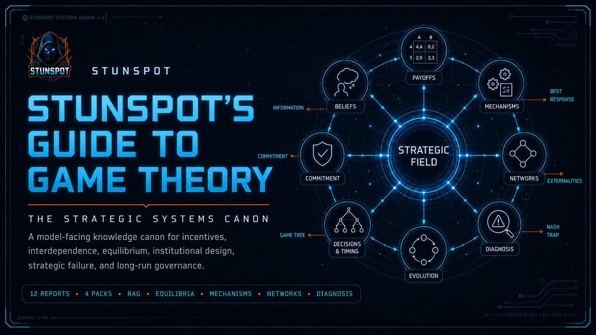

  

# Stunspot's Guide to Game Theory

**The Strategic Systems Canon**  
*A model-facing knowledge canon for incentives, interdependence, equilibrium, institutional design, strategic failure, and long-run governance.*

This site is the navigation layer for the repository. The report corpus itself lives under `knowledge-packs/`:

- `knowledge-packs/by-report/` — canonical individual source reports.
- `knowledge-packs/compiled-packs/` — grouped upload packs, recommended for most AI/RAG use.
- `knowledge-packs/omnibus/` — one whole-corpus bundle.

The `docs/` directory exists to orient readers and GitHub Pages. It is not a duplicate report directory, and this canon does not use `docs/reports/`.

---

## Start Here

| Page | Use It For |
|---|---|
| [Canon Map](./canon-map.md) | Understanding the A-L report sequence and the four-volume architecture. |
| [How to Use This Canon](./how-to-use-this-canon.md) | Loading the canon into AI/RAG systems, reading by problem type, and preserving source traceability. |
| [Knowledge Packs](./knowledge-packs.md) | Choosing between source reports, compiled packs, and the omnibus bundle. |

---

## What the Canon Gives a Model

Loaded as project knowledge or retrieval substrate, this canon gives an assistant a disciplined strategic vocabulary:

- strategic interdependence rather than isolated choice
- best responses, equilibrium, common knowledge, and information asymmetry
- formal representation through matrices, trees, information sets, and type spaces
- timing, credibility, threats, promises, commitments, and subgame structure
- bargaining, coalitions, repeated interaction, reputation, and cooperation collapse
- mechanism design and institutional engineering
- evolutionary, networked, and externality-driven strategic dynamics
- failure diagnosis, inverse reconstruction, validation, and institutional evolution

The point is practical augmentation: help models reason about strategic systems with explicit structure instead of vague motive-talk.

---

## Recommended Entry Points

- **Use the compiled packs** for most AI/RAG uploads.
- **Use source reports** when you need precise retrieval units or file-level citation.
- **Use the omnibus** when your tool performs best with one large file or you want a local archive.
- **Start with Reports J-K** when diagnosing a failing system.
- **Start with Report G** when designing incentives, platforms, institutions, rules, or compliance systems.
- **Start with Reports A-C** when building a strategic reasoning foundation from first principles.

---

## Release Facts

- Version: **1.0**
- Release date: **2026-06-28**
- Source reports: **12**
- Compiled packs: **4**
- Omnibus files: **1**
- License: **CC BY-NC-SA 4.0**

Citation metadata is maintained in `CITATION.cff`. No `zenodo.json` file is included in this release package.
